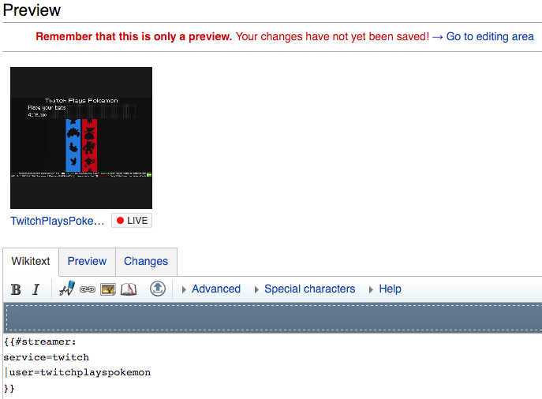

The **Streamer** extension displays information about streamers from various streaming services.  It can display information as simple as online/offline to as extensive as the current thumbnail.

* **Project Homepage:** [Documentation at Github](https://github.com/CurseStaff/Streamer)
* **Mediawiki Extension Page:** [Extension:Streamer](https://www.mediawiki.org/wiki/Extension:Streamer)
* **Source Code:** [Source Code at Github](https://github.com/CurseStaff/Streamer)
* **Bug Reports and Feature Requests:** [Issue Tracker at Github](https://github.com/CurseStaff/Streamer/issues)
* **Licensing:** Streamer is released under [The GNU Lesser General Public License, version 3.0](http://opensource.org/licenses/lgpl-3.0.html).

#Installation

Download and place the file(s) in a directory called Streamer in your extensions/ folder.

Add the following code at the bottom of your LocalSettings.php:

	require_once("$IP/extensions/Streamer/Streamer.php");

Done! Navigate to "Special:Version" on your wiki to verify that the extension is successfully installed.

##Configuration
Streamer only requires configuration if the YouTube service will be used.

|          Setting         | Default | Description                                                                                                                                              |
|:-------------------------|---------|----------------------------------------------------------------------------------------------------------------------------------------------------------|
| $wgYouTubeApiKey         | null    | Accessing the YouTube API requires [registering with Google and obtaining an API key](https://developers.google.com/youtube/registering_an_application). |

#Usage

##Tags

###\#streamer - Parser Tag
The #streamer parser tag takes what service is being used, who the user is, and optionally how to display the information.

Basic Syntax:

	{{#streamer:
	service=[Service]
	|user=[User]
	}}

####Parameters for #streamer Tag

|       Parameter       | Required | Default | Description                                                                                                                            |
|----------------------:|----------|---------|----------------------------------------------------------------------------------------------------------------------------------------|
| service               | yes      |         | The service name to look up users on.  See **Supported Streaming Services**.                                                           |
| user                  | yes      |         | The user identifier for user on the streaming service.                                                                                 |
| template              | no       | block   | **Built In**: block, debug, link, live, minilive, thumbnail, viewers  Use a built in template or specify a custom template to use. |
| link                  | no       |         | Fully qualifed URL to override the link in templates.                                                                                  |

####Example

To display the default block template for TwitchPlaysPokemon from the Twitch streaming service:

	{{#streamer:
	service=Twitch
	|user=twitchplayspokemon
	}}

####Templates
There are seven built in templates that come with the extension; block, debug, link, live, minilive, thumbnail, and viewers.  By default if no template is specified it uses the block template.

#####Custom
Which template is used to display streamer information can be customized through Mediawiki's templating system.  Using the "template" parameter simply add the template page name into the parser call.  **Example: template=Template:BlockCustom**

There are several replacement variables used in the templates that will be automatically filled in with the correct information.

* **%ONLINE%** - Integer based boolean if the streamer is online.  Use the {{#ifeq:...}} parser function to check against this.
* **%NAME%** - Streamer's display name, as reported from the streaming service.  Will fall back to the streamer's user name if one is not available.
* **%VIEWERS%** - Number of current live viewers.
* **%DOING%** - What the streamer is doing.  This is typically the name of a video game they are playing.
* **%STATUS%** - Custom status field set by the channel.  This might be a custom stream title or social status depending on the service.
* **%LIFETIME_VIEWS%** - Number of overall lifetime views on the channel.  This count may include video on demand views depending on the service.
* **%FOLLOWERS%** - Number of followers(subscriptions) that the channel has.
* **%LOGO%** - Static logo image of the user or channel avatar.
* **%THUMBNAIL%** - Periodically updated thumbnail image of a currently live stream.
* **%CHANNEL_URL%** - Direct unmodified URL to the channel on the service.
* **%LINK%** - URL to the streamer's page on the service.  If a custom page link is specified in the Special:StreamerInfo interface it will be used instead.

#####Built In
The built in templates below are copied from the StreamerTemplate class file and are placed here for reference purposes.  They can be used to assist in building custom templates.

######block
	

		

		

			
<a href='%LINK%'>%NAME%</a>

			

{{#ifeq:%ONLINE%|1|".wfMessage('stream_online')->escaped()."|".wfMessage('stream_offline')->escaped()."}}

		

	

######debug
	

		<ul>
			<li>ONLINE => %ONLINE%</li>
			<li>NAME => %NAME%</li>
			<li>VIEWERS => %VIEWERS%</li>
			<li>DOING => %DOING%</li>
			<li>STATUS => %STATUS%</li>
			<li>LIFETIME_VIEWS => %LIFETIME_VIEWS%</li>
			<li>FOLLOWERS => %FOLLOWERS%</li>
			<li>LOGO => %LOGO%</li>
			<li>THUMBNAIL => %THUMBNAIL%</li>
			<li>CHANNEL_URL => %CHANNEL_URL%</li>
			<li>LINK => %LINK%</li>
		</ul>
	

######link
	
<a href='%LINK%'>%NAME%</a>

######live
	

		

			
<a href='%LINK%'>%NAME%</a>

			

{{#ifeq:%ONLINE%|1|".wfMessage('stream_online')->escaped()."|".wfMessage('stream_offline')->escaped()."}}

		

	

######minilive
	

		

			
<a href='%LINK%'>%NAME%</a>

			

		

	

######viewers
	

		

			
<a href='%LINK%'>%NAME%</a>

			

%VIEWERS%

		

	

######thumbnail
	

		

	

###\#streamerinfo - Parser Meta Tag
The #streamerinfo parser meta tag takes what service is being used and who the user is to tag an article as related to that person.  It will cause any links automatically generated from the #streamer tag to use the article page as the destination and display name.  Streamer information created from tagging or manually entered will be visible in the Special:StreamerInfo interface.  Note: Articles tagged with the #streamerinfo tag will override any manually entered information.

Basic Syntax:

	{{#streamerinfo:
	service=[Service]
	|user=[User]
	}}

####Parameters for #streamerinfo Tag

|       Parameter       | Required | Default | Description                                                                                                                     |
|----------------------:|----------|---------|---------------------------------------------------------------------------------------------------------------------------------|
| service               | yes      |         | The service name to look up users on.  See **Supported Streaming Services**.                                                    |
| user                  | yes      |         | The user identifier for user on the streaming service.                                                                          |

####Example

To tag the article "Twitch Plays Pokemon" with the Twitch user "twitchplayspokemon":

	{{#streamerinfo:
	service=Twitch
	|user=twitchplayspokemon
	}}

This would cause all output from the #streamer tag to reference to the "Twitch Plays Pokemon" when generating links and display names.

##Supported Streaming Services

|  Service  | Parameter Value | Web Site                 |
|----------:|-----------------|--------------------------|
| Azubu.tv  | azubu           | http://www.azubu.tv/     |
| Beam      | beam            | http://beam.pro/         |
| Twitch.tv | twitch          | http://www.twitch.tv/    |
| YouTube   | youtube         | https://www.youtube.com/ |